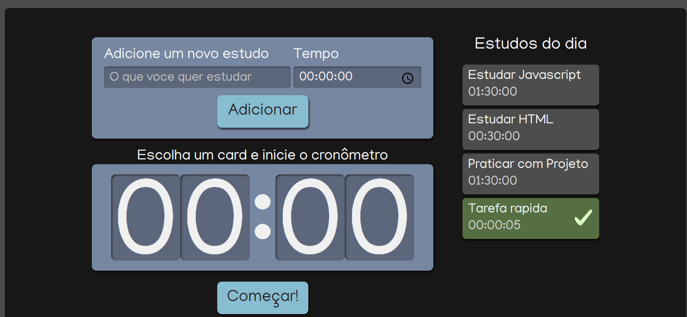

<h1 align="center"> Watch Studies</h1>

Desenvolvido como desafio do curso de REACT: ESCREVENDO COM TYPESCRIPT da Alura e complementado  pequenas surpresas

  <a href="#-tecnologias">Tecnologias</a>&nbsp;&nbsp;&nbsp;|&nbsp;&nbsp;&nbsp;
  <a href="#-projeto">Projeto</a>&nbsp;&nbsp;&nbsp;|&nbsp;&nbsp;&nbsp;
  <a href="#memo-licença">Licença</a>

  

 

  

## 🚀 Tecnologias

Esse projeto foi desenvolvido com as seguintes tecnologias:

- Javascript
- React
- SASS
- CSS modules
- Git e Github

## 💻 Projeto

Watch studies é um cronometro para cadastrar tarefas/estudos e manter o controle do tempo dessas atividades.

## :memo: Licença

Esse projeto está sob a licença MIT.

---

Feito com ♥ by [LuPeBreak](https://github.com/LuPeBreak/) como um desafio do curso de REACT: ESCREVENDO COM TYPESCRIPT da [Alura](https://cursos.alura.com.br/).